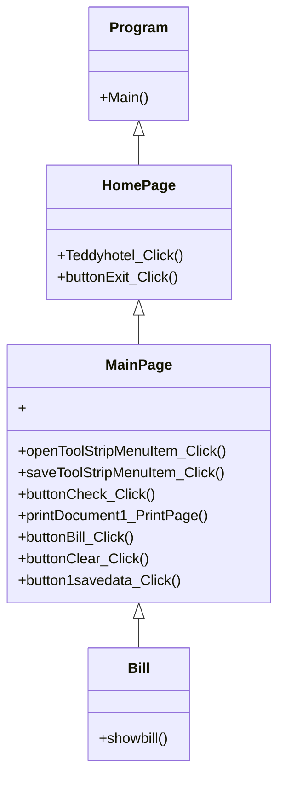

## Teddy Hotel
### ความเป็นมาของโปรแกรม
จารย์สั่ง

  
### วัตถุประสงค์ของโปรแกรม
ทำเอาคะแนน

  
### โครงสร้างของโปรแกรม

```mermaid
classDiagram
    Program <|-- HomePage
    HomePage <|-- MainPage
    MainPage <|-- Bill
    Program : +Main()
    class HomePage{
        +Teddyhotel_Click()
        +buttonExit_Click()
    }
    class MainPage{
        +openToolStripMenuItem_Click()
        +saveToolStripMenuItem_Click()
        +buttonCheck_Click()
        +printDocument1_PrintPage()
        +buttonBill_Click()
        +buttonClear_Click()
        +button1savedata_Click()
        +
    }
    class Bill{
        +showbill()
    }
  
```
  
### ผู้พัฒนาโปรแกรม
