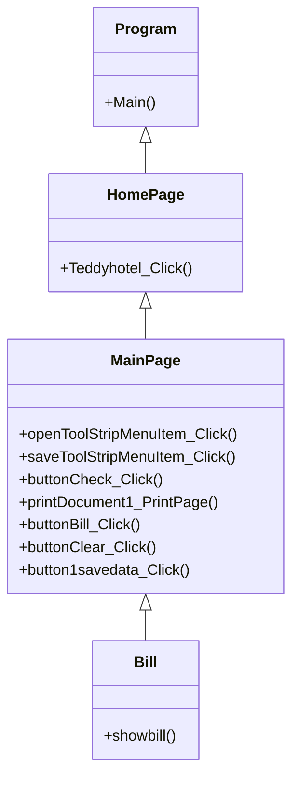

## Teddy Hotel
### ความเป็นมาของโปรแกรม
    ในปัจจุบันมีการจัดการข้อมูลห้องพักที่ยุ่งยาก และใช้งานยาก เลยอยากจะทำโปรแกรมที่ง่ายสะดวก
    
    นอกจากนี้ยังมีระบบการจัดเก็บข้อมูลที่เป็นระเบียบ ทำให้ข้อมูลถูกเก็บอย่างปลอดภัย ง่ายต่อการค้นหาและใช้งาน
    
    
    

  
### วัตถุประสงค์ของโปรแกรม
1.เพื่อให้สะดวกต่อการใช้งาน

2.สามารถจัดการข้อมูลห้องพักได้อย่างมีประสิทธิภาพ

3.เพื่อศึกษารูปแบบการทำงาน และวิเคราะห์กระบวนการทำงาน

  
### โครงสร้างของโปรแกรม

  
### ผู้พัฒนาโปรแกรม
นางสาวณัฐธิดา บุญพา 643450647-2
