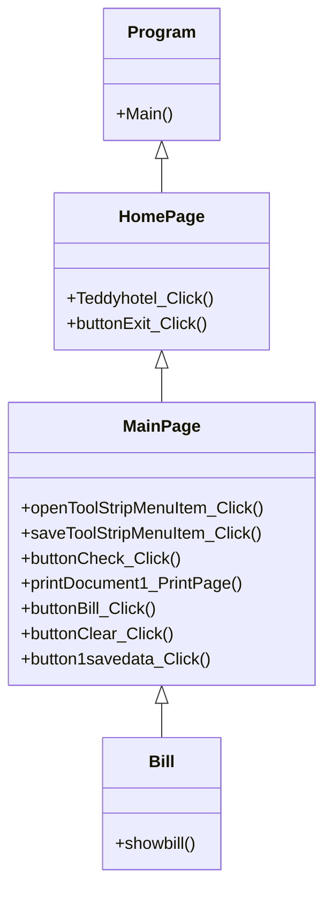

## Teddy Hotel
### ความเป็นมาของโปรแกรม
    ในปัจจุบันมีการจัดการข้อมูลห้องพักที่ยุ่งยาก และใช้งานยาก เลยอยากจะทำโปรแกรมที่ง่ายสะดวก 

  
### วัตถุประสงค์ของโปรแกรม
1.เพื่อให้สะดวกต่อการใช้งาน
2.สามารถจัดการข้อมูลห้องพักได้อย่างมีประสิทธิภาพ
3.อยากศึกษา

  
### โครงสร้างของโปรแกรม

  
### ผู้พัฒนาโปรแกรม
นางสาวณัฐธิดา บุญพา 643450647-2
